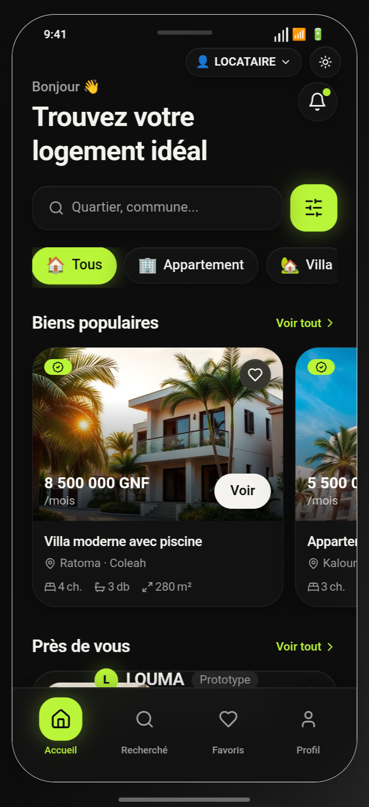
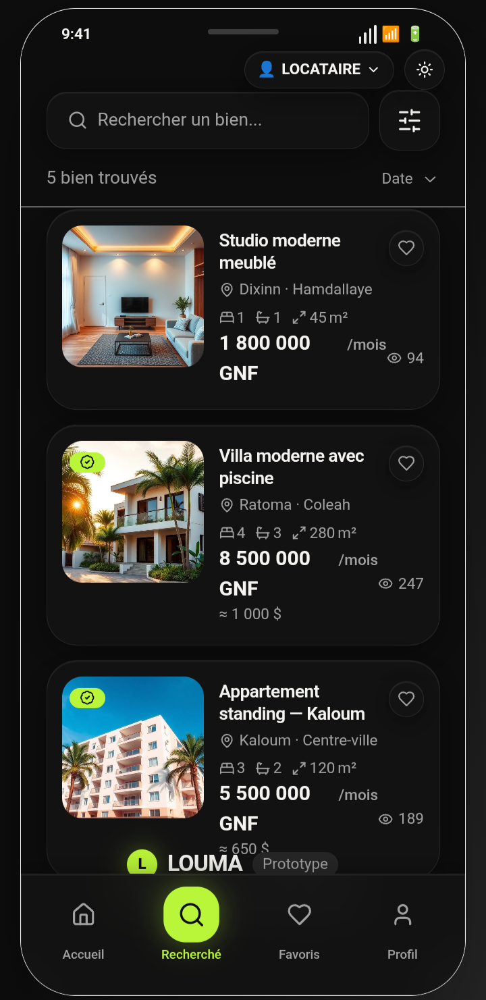
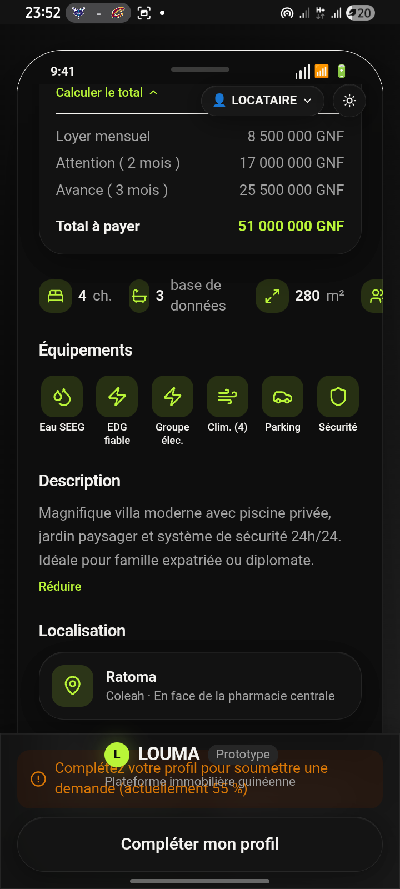
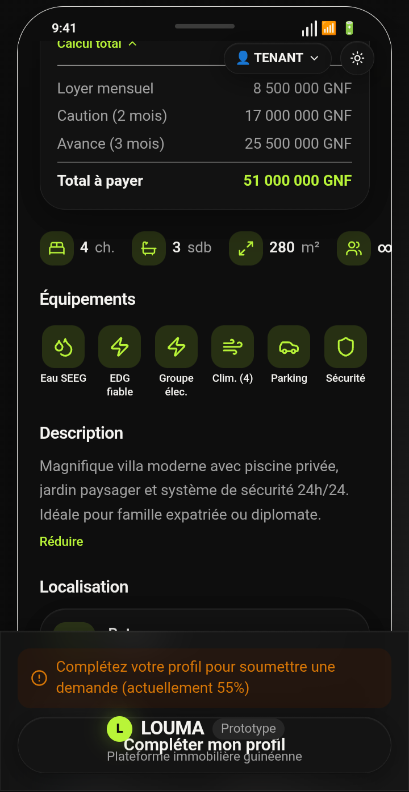
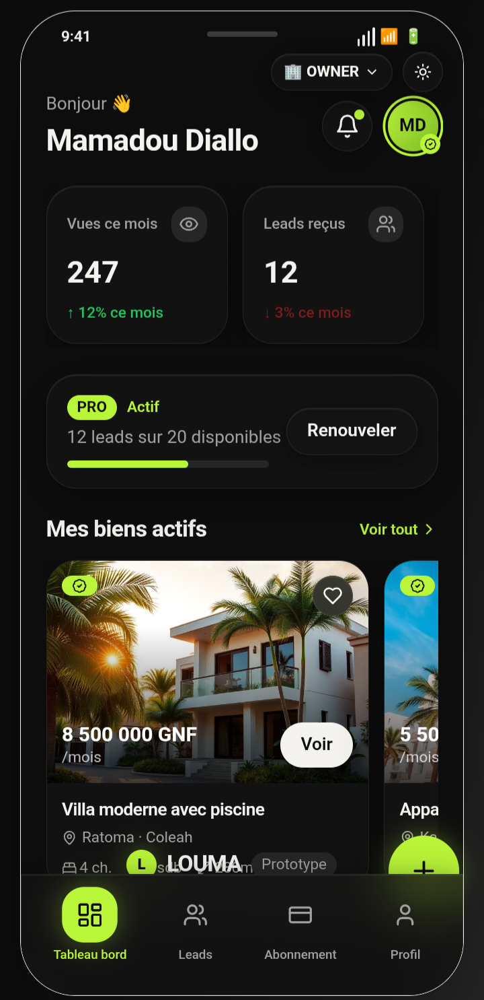
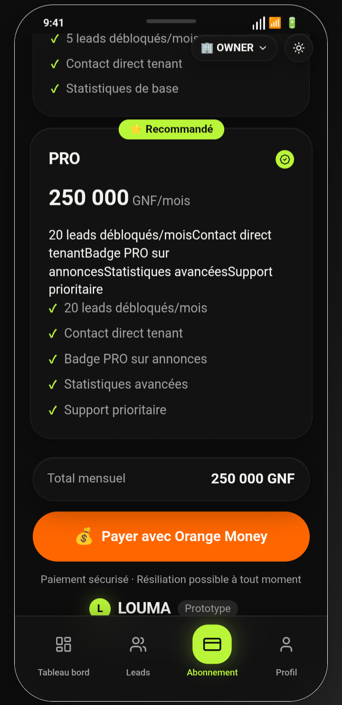

# LOUMA - Plateforme Immobilière Guinéenne

## 📋 Vue d'ensemble

**LOUMA** est une application mobile React Native (Expo SDK 54) pour le marché immobilier guinéen, permettant la mise en relation entre locataires et propriétaires/agences immobilières.

## 📱 Aperçu de l'application

### Expérience Locataire
| Accueil | Recherche | Détails | Calculateur |
| :---: | :---: | :---: | :---: |
|  |  |  |  |

### Espace Propriétaire & Profil
| Tableau de Bord | Gestion Leads | Abonnement PRO | Profil Utilisateur |
| :---: | :---: | :---: | :---: |
|  |  |  |  |

### Thèmes & Design
| Mode Sombre | Mode Clair |
| :---: | :---: |
|  |  |

**Architecture**: Monorepo séparé en `frontend/` et `backend/` pour une meilleure scalabilité et maintenabilité.

## 🏗️ Structure du Projet

```
louma-app/
├── frontend/           # 📱 Application React Native/Expo
├── backend/            # 🖥️ API REST Express/TypeScript  
├── shared/             # 📚 Types et schémas communs
├── docs/               # 📖 Documentation et roadmap
└── README.md           # 📋 Ce fichier
```

## 🚀 Démarrage Rapide

### Prérequis
- Node.js 18+
- PostgreSQL
- Expo CLI

### Installation
```bash
# Installer les dépendances
npm run install:all

# Démarrer le backend
cd backend && npm run dev

# Démarrer le frontend (nouveau terminal)
cd frontend && npm run expo:dev
```

### Scripts Disponibles
```bash
npm run install:all    # Installer toutes les dépendances
npm run dev:all        # Démarrer frontend + backend
npm run dev:frontend   # Démarrer uniquement le frontend
npm run dev:backend    # Démarrer uniquement le backend
npm run build:all      # Build frontend + backend
npm run test:all       # Tests frontend + backend
npm run db:push        # Synchroniser la base de données
```

> 📖 **Guide complet** : Voir `docs/UTILISATION.md` pour des instructions détaillées étape par étape

## 📱 Application Mobile (Frontend)

### Écrans Implémentés
1. **Accueil** (`app/(tabs)/index.tsx`)
   - Hero section avec recherche
   - Catégories de biens
   - Biens populaires (scroll horizontal)
   - Biens près de vous (liste verticale)

2. **Recherche** (`app/(tabs)/search.tsx`)
   - Barre de recherche avec filtrage temps réel
   - Compteur de résultats
   - Filtres actifs supprimables

3. **Favoris** (`app/(tabs)/favorites.tsx`)
   - Liste des biens sauvegardés
   - Persistance AsyncStorage

4. **Profil** (`app/(tabs)/profile.tsx`)
   - Informations utilisateur
   - Score de qualification
   - Menu navigation

5. **Détail Propriété** (`app/property/[id].tsx`)
   - Carousel d'images
   - Informations complètes
   - Calculateur de coût total
   - Équipements et restrictions

6. **Filtres** (`app/filters.tsx`)
   - Modal complet avec critères spécifiques Guinée
   - Multi-sélection communes
   - Critères locaux (eau, électricité, accès pluies)

7. **Onboarding** (`app/onboarding.tsx`)
   - 3 slides animés
   - Persistance état

### Design System
- **Thème**: Light/Dark automatique
- **Palette**: Fond chaud `#F5F5F0` / `#0D0D0D`, accent lime `#B8F53A`
- **Style**: Glassmorphism avec BlurView
- **Police**: Inter (Google Fonts)
- **Icônes**: @expo/vector-icons
- **Spacing**: Base 8px systématique

## 🖥️ Serveur Backend

### Architecture Express
- **CORS**: Configuré pour Replit et localhost
- **Logging**: Requests API avec durée et réponse
- **Static files**: Assets et build Expo
- **Error handling**: Middleware centralisé
- **Landing page**: Template HTML dynamique

### Base de Données
- **Schema**: Table `users` basique (id, username, password)
- **ORM**: Drizzle avec PostgreSQL
- **Migrations**: Dossier `./migrations`

## 🌍 Spécificités Guinéennes

### Localisation
- **Communes**: Ratoma, Matam, Kaloum, Matoto, Dixinn
- **Devises**: GNF (formatage avec espaces) et USD
- **Critères locaux**: 
  - Eau: SEEG fiable/intermittente, Puits, Citerne
  - Électricité: EDG fiable/intermittente, Groupe, Solaire
  - Accès saison des pluies
  - Groupe électrogène inclus

### Données
- **8 propriétés d'exemple** dans `lib/sample-data.ts`
- **Images Unsplash** pour les démonstrations

## 🔧 Configuration & Déploiement

### Scripts Disponibles
```json
{
  "expo:dev": "Développement Expo avec proxy Replit",
  "server:dev": "Serveur Express en développement", 
  "db:push": "Migrations Drizzle",
  "expo:static:build": "Build Expo production",
  "server:prod": "Serveur Express production"
}
```

### Environnement
- **Replit**: Configuration proxy automatique
- **Expo**: New Architecture activée, React Compiler expérimental
- **TypeScript**: Routes typées activées

## 📊 État Actuel

### ✅ Phase 1: Backend - Terminée à 60%

#### 🗄️ Base de Données Complète
- **8 tables** PostgreSQL avec Drizzle ORM
- **Types spécifiques Guinée** : Communes (Ratoma, Matam, Kaloum, Matoto, Dixinn)
- **Services essentiels** : Eau (SEEG, Puits, Citerne), Électricité (EDG, Groupe, Solaire)
- **Relations optimisées** : users ↔ properties ↔ images ↔ favorites ↔ leads
- **Indexation avancée** pour performances

#### 🔌 API REST Propriétés - 100% Opérationnel
- `GET /api/properties` - Liste avec filtres (prix, commune, type, équipements)
- `GET /api/properties/search` - Recherche texte full-text
- `GET /api/properties/:id` - Détail propriété + compteur vues
- `POST /api/properties` - Création (validation Zod)
- `PUT /api/properties/:id` - Mise à jour (propriétaire uniquement)
- `DELETE /api/properties/:id` - Suppression (propriétaire uniquement)
- `GET /api/properties/owner/:ownerId` - Propriétés par propriétaire

#### 🛠️ Services Backend Robustes
- **PropertyService** : CRUD complet avec filtres complexes
- **ImageService** : Gestion multi-images avec ordre et image principale
- **Database** : Connexion PostgreSQL avec pool et transactions

### 🔄 MVP Frontend Terminé
- Interface utilisateur complète
- Données locales fonctionnelles
- Navigation fluide
- Design moderne glassmorphism

### ⏳ Prochaines Étapes Prioritaires

#### 🔐 Phase 1 Suite: Authentification & Sécurité
- JWT tokens avec refresh
- Middleware de protection routes
- Register/Login API
- Gestion rôles (TENANT/OWNER/AGENCY)

#### 📸 Phase 2: Upload & Gestion Images
- Upload multi-fichiers avec validation
- Stockage local/cloud optimisé
- Redimensionnement automatique
- CDN integration

#### 👤 Phase 3: Gestion Utilisateurs Complète
- Profile CRUD avec avatars
- Système de vérification documents
- Scores de confiance
- Notifications preferences

## 🎯 Points Forts

1. **Architecture solide**: Séparation claire frontend/backend avec workspaces
2. **Backend robuste**: API REST complète avec PostgreSQL + Drizzle ORM
3. **Base de données optimisée**: 8 tables avec indexation et relations
4. **Design moderne**: Glassmorphism et thème light/dark
5. **Localisation**: Adaptation spécifique marché guinéen
6. **Performance**: React Query, new architecture Expo
7. **Type Safety**: TypeScript strict avec validation Zod
8. **UX optimisée**: Navigation native, animations fluides

## 📈 Potentiel d'Évolution

Le projet est bien structuré pour évoluer vers une plateforme complète avec:
- **Backend scalable**: API modulaire et services réutilisables
- **Système complet**: Authentification, messagerie, paiements
- **Analytics avancés**: Tracking utilisateur et métriques immobilières
- **Multi-pays**: Extension autres marchés africains

**Statut**: Backend à 60% - Frontend MVP terminé - Prêt pour intégration complète
