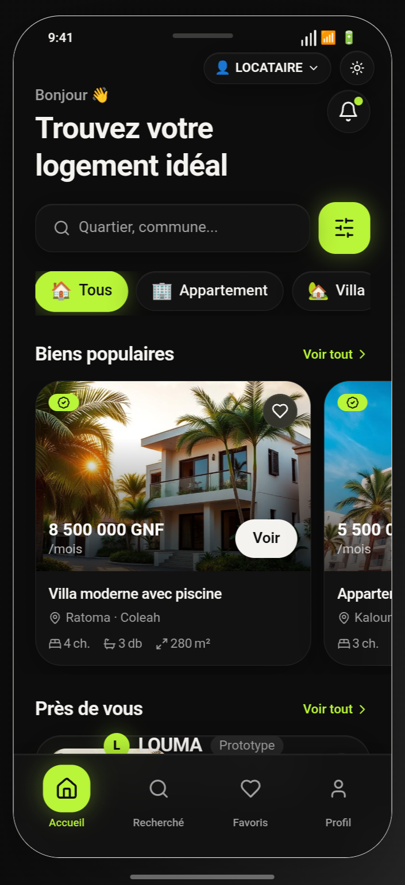
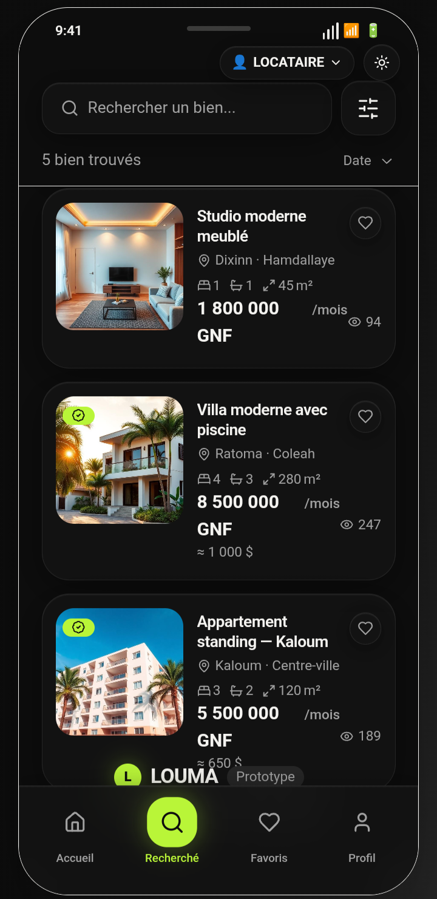
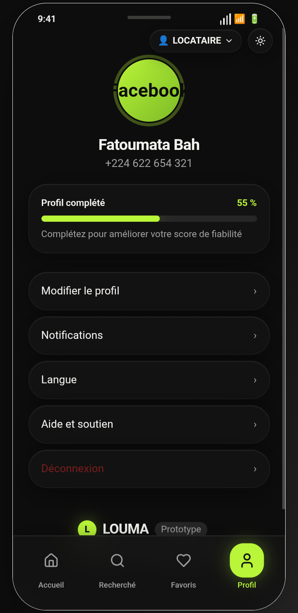
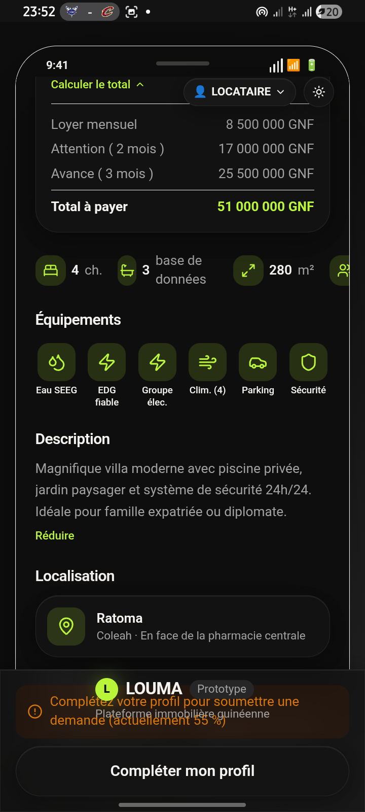
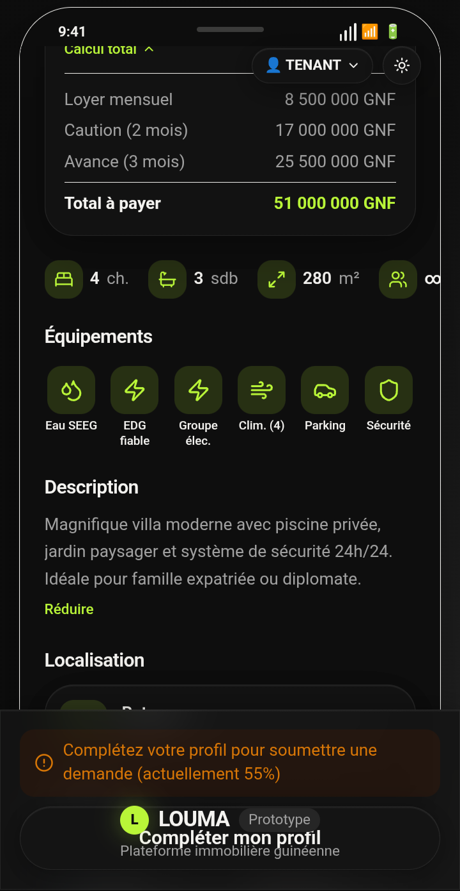
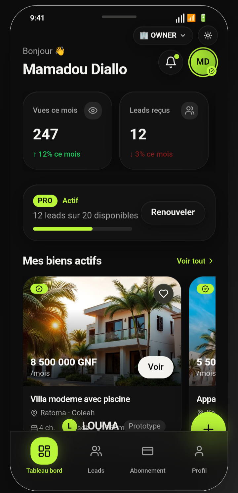
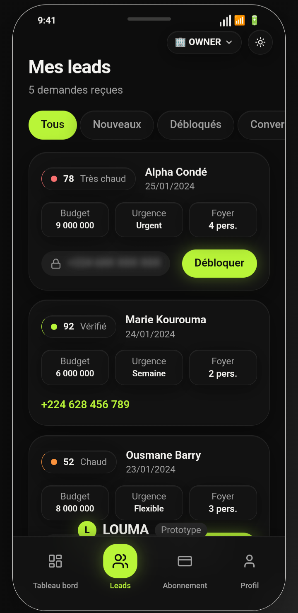
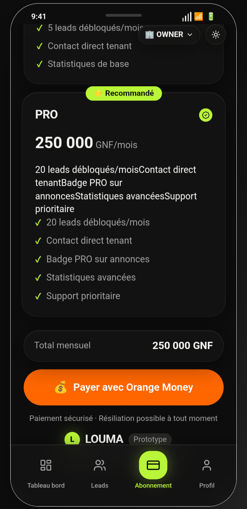
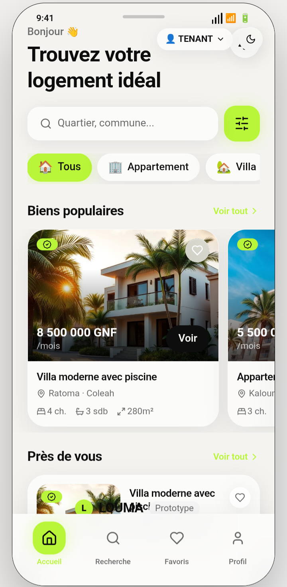

# LOUMA - Plateforme Immobilière Guinéenne

## � Aperçu de l'Application

### 🏠 Écran d'accueil
<table>
  <tr>
    <td></td>
    <td></td>
  </tr>
  <tr>
    <td align="center"><strong>Accueil & Navigation</strong></td>
    <td align="center"><strong>Recherche de propriétés</strong></td>
  </tr>
</table>

### 🔍 Recherche et Filtres
<table>
  <tr>
    <td></td>
    <td></td>
  </tr>
  <tr>
    <td align="center"><strong>Filtres avancés</strong></td>
    <td align="center"><strong>Liste des propriétés</strong></td>
  </tr>
</table>

### 📋 Détails des Propriétés
<table>
  <tr>
    <td></td>
    <td></td>
  </tr>
  <tr>
    <td align="center"><strong>Fiche complète</strong></td>
    <td align="center"><strong>Photos multiples</strong></td>
  </tr>
</table>

### 👤 Gestion Utilisateur
<table>
  <tr>
    <td></td>
    <td></td>
  </tr>
  <tr>
    <td align="center"><strong>Profil & Paramètres</strong></td>
    <td align="center"><strong>Dashboard propriétaire</strong></td>
  </tr>
</table>

### 📱 Version Mobile
<table>
  <tr>
    <td colspan="2" align="center"></td>
  </tr>
  <tr>
    <td colspan="2" align="center"><strong>Expérience mobile native</strong></td>
  </tr>
</table>

---

## �📋 Vue d'ensemble

**LOUMA** est une application mobile React Native (Expo SDK 54) pour le marché immobilier guinéen, permettant la mise en relation entre locataires et propriétaires/agences immobilières. Le projet utilise une architecture moderne **100% Serverless** avec un frontend React Native robuste et une intégration directe avec **Supabase** pour l'authentification, la base de données PostgreSQL et le stockage média.

## 🏗️ Architecture Technique

LOUMA repose sur une séparation claire des responsabilités :

- **Frontend** : React Native/Expo avec `expo-router`. Gestion d'état via React Context et TanStack Query.
- **Backend (BaaS)** : Intégration complète **Supabase** (Auth, Database, Storage, Edge Functions).
- **Base de Données** : PostgreSQL avec RLS (Row Level Security) activé sur toutes les tables.
- **Stockage** : Supabase Storage pour les photos de biens, avatars et documents.

## � Dernières Mises à Jour

### ✅ Migration Complète vers Supabase (Mars 2026)
- **Suppression du backend Express** : Migration complète vers l'architecture Supabase Serverless
- **Services unifiés** : `propertyService.ts` et `leadService.ts` utilisent directement le SDK Supabase
- **Correction des imports** : Résolution des erreurs `useQuery is not defined` et imports manquants
- **Configuration simplifiée** : Plus besoin de backend local, uniquement les variables Supabase

### 🔧 Corrections Techniques
- **HomeScreen** : Ajout des imports `useQuery` et `TouchableOpacity` manquants
- **SearchScreen** : Migration de `propertiesApi` vers `propertyService`
- **PropertyDetail** : Migration vers `propertyService.getPropertyById()`
- **ImageUploader** : Correction des méthodes d'upload et suppression d'images

## 📸 Gestion des Médias

Le système d'upload d'images est optimisé pour être robuste et hybride.

### Fonctionnalités Clés
- **Support Hybride** : Fonctionne parfaitement sur **Web** (via Blobs) et **Mobile** (via `expo-file-system`).
- **Upload Centralisé** : Logique unique dans `propertyService.ts` pour garantir la cohérence des chemins (`properties/userId/filename`).
- **Fiabilité** : Gestion d'erreurs par image lors de l'ajout multiple de photos pour un bien.
- **Optimisation** : Pas de conversion Base64 inutile sur le Web, réduisant la consommation mémoire.

### ⚙️ Configuration du Stockage (SQL)
Pour activer l'upload, exécutez ce SQL dans votre console Supabase :
```sql
-- Créer le bucket public
INSERT INTO storage.buckets (id, name, public) VALUES ('property-images', 'property-images', true) ON CONFLICT (id) DO NOTHING;

-- Politiques RLS
CREATE POLICY "Images publiques" ON storage.objects FOR SELECT TO public USING (bucket_id = 'property-images');
CREATE POLICY "Upload authentifié" ON storage.objects FOR INSERT TO authenticated WITH CHECK (bucket_id = 'property-images');
CREATE POLICY "Suppression propriétaire" ON storage.objects FOR DELETE TO authenticated USING (bucket_id = 'property-images' AND (storage.foldername(name))[1] = 'properties');
```

## 🎨 Système de Thèmes

L'application propose une gestion de thèmes avancée et persistante.

- **Modes** : Clair (Light), Sombre (Dark) et Automatique (Système).
- **Contrôle utilisateur** : Sélecteur dédié dans l'écran de profil.
- **Persistance** : Le choix de l'utilisateur est sauvegardé localement via `AsyncStorage`.
- **UI Cohérente** : Intégration de `StatusBar` dynamique et `BlurView` adaptatif.

## 🔐 Système d'Authentification

Conçu pour la sécurité et le contexte local guinéen.
- **Authentification par email** : Identifiant principal via Supabase Auth.
- **Rôles** : `TENANT` (Locataire), `OWNER` (Propriétaire) et `AGENCY` (Agence).
- **Score de Complétion** : Profil évolutif (25% à 100%) selon les infos fournies.

## 🏠 Gestion des Propriétés & Leads

- **Filtres Guinéens** : Critères spécifiques (SEEG fiable, EDG fiable, accès saison des pluies).
- **Dashboard Propriétaire** : Les propriétaires peuvent gérer leurs prospects directement depuis l'application :
    - **Contact Rapide** : Boutons directs pour appeler ou envoyer un message **WhatsApp** pré-rempli au locataire.
    - **Gestion du Cycle de Vie** : Mise à jour du statut (`Nouveau`, `Contacté`, `Visité`, `Clos`) en un clic.
- **Badge de Vérification Dynamique** : Le badge "✓ Vérifié" s'affiche automatiquement sur les annonces si le propriétaire a complété son score KYC à **100%**.

## 🔔 Notifications & Temps Réel

- **Push Notifications** : L'application enregistre automatiquement les tokens de notification (EAS) dans Supabase pour permettre l'envoi d'alertes en temps réel (ex: nouvelle demande reçue).
- **Temps Réel** : Les changements de statut sont immédiatement répercutés grâce à TanStack Query et Supabase.

## 📊 État Actuel du Projet

### ✅ Phase 1 : Infrastructure & Auth - 100% Terminé
- [x] Schéma PostgreSQL avec RLS complet.
- [x] Intégration Supabase Auth.
- [x] Système de thèmes manuel et automatique.

### ✅ Phase 2 : Médias & Profils - 100% Terminé
- [x] Système d'upload d'images hybride (Web/Mobile).
- [x] Gestion des avatars et photos de biens.
- [x] Profil utilisateur avec score de complétion automatique (Trigger SQL).

### ✅ Phase 3 : Fonctionnalités Avancées - 100% Terminé
- [x] Système de vérification de documents (KYC).
- [x] Dashboard Propriétaire avec actions de contact (WhatsApp/Appel).
- [x] Synchronisation des Push Tokens.

### ✅ Phase 4 : Migration Serverless - 100% Terminé
- [x] Suppression complète du backend Express.
- [x] Migration des services vers Supabase SDK.
- [x] Correction des erreurs d'imports et de dépendances.
- [x] Configuration simplifiée avec variables d'environnement.

---
**Statut**: Application 100% fonctionnelle et déployable (Architecture Serverless Supabase).

## 🚀 Installation & Lancement

#### Prérequis
- Node.js 18+
- Compte Supabase avec projet créé
- Expo CLI

#### Configuration
1. Cloner le repository
2. Configurer le fichier `frontend/.env` :
```env
EXPO_PUBLIC_SUPABASE_URL=votre_url_supabase
EXPO_PUBLIC_SUPABASE_ANON_KEY=votre_cle_anon
```

#### Lancement
```bash
# Installer les dépendances
npm install
cd frontend && npm install

# Lancer l'application
npx expo start -c
```

#### Accès
- **Web** : http://localhost:8081
- **Mobile** : Scanner le QR code avec Expo Go
- **Débogage** : Ouvrir les outils de développement du navigateur

---
**Dernière mise à jour** : Mars 2026 - Migration complète vers Supabase Serverless
